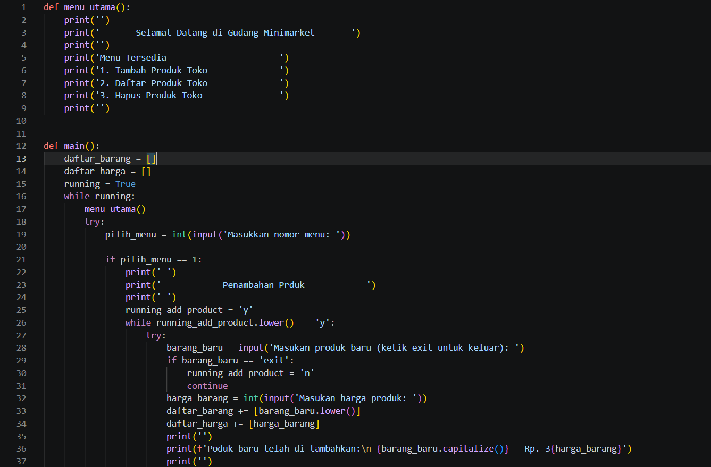
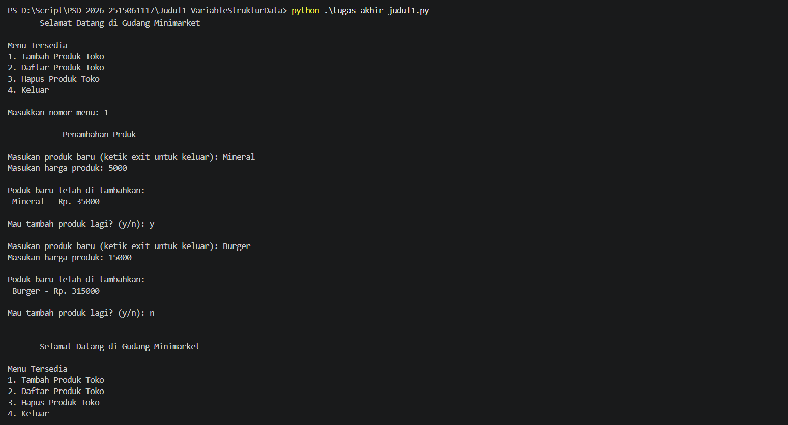
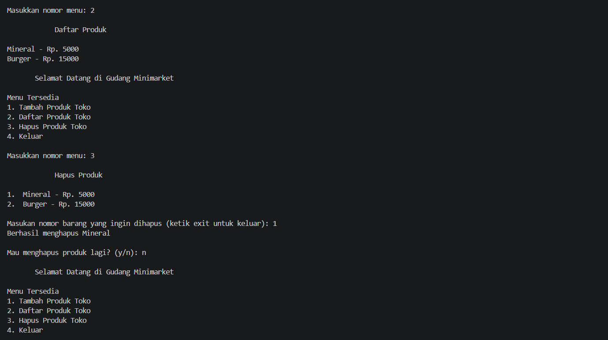
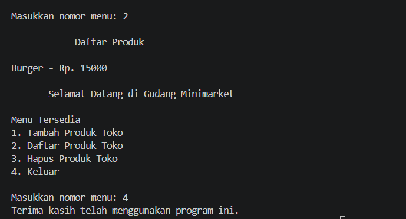

<h3>Pada halaman ini</h3>

- [Penjelasan Kode](https://github.com/jeremy776/PSD-2026-2515061117/tree/main/Judul1_VariableStrukturData#penjelasan-kode-yang-saya-buat)
- [Screenshoot Output](https://github.com/jeremy776/PSD-2026-2515061117/tree/main/Judul1_VariableStrukturData#screenshoot-output)
- [Video Penjelasan](https://github.com/jeremy776/PSD-2026-2515061117/tree/main/Judul1_VariableStrukturData#video-penjelasan)
   
<h1 style='text-align: center'>Management Gudang</h1>

Sebuah Program yang saya buat untuk menyelesaikan Tugas Akhir dari Praktikum Struktur Data pada judul satu yaitu mengenai <b>VariableStrukturData</b>. Pada tugas akhir ini, saya memilih untuk membuat sebuah program untuk mengatur atau mendata sebuah barang pada gudang dan kali ini menggunakan List1D.

<h3>Mengapa Pilih ini?</h3>

Saya memilih management gudang sebagai tugas akhir dikarenakan menurut saya, program ini sangat diperlukan terutama pada sebuah tempat usaha seperti:

- Minimarket (Alfamart, Indomaret, dll)
- Toko Sembako, Toko Bangunan
- Apotik

<h3>Kapan ini dapat digunakan?</h3>
Program ini dapat digunakan ketika ada barang yang masuk atau keluar kedalam toko dan perlu dicatat (tanpa perlu pencatatan manual), dan juga ini bisa dimanfaatkan untuk melihat stok barang yang tersedia.
 
 
 
<h4>Penjelasan kode yang saya buat</h4>

Pada baris awal saya membuat sebuah fungsi <code>menu_utama()</code> ini berguna untuk menampilkan menu apasaja yang tersedia di dalam program ini.

baris ke 12 merupakan fungsi utama dari program ini. ini merupakan fungsi yang didalam nya berisi kode yang membuat program ini berjalan dengan sempurna

pada baris ke 13 dan 14, saya mendeklarasikan sebuah variable dengan nama nya <code>daftar_barang</code> dan <code>harga_barang</code> yang dimana isi nya adalah sebuah List. dibawah nya ada variable <code>running = True</code> jadi pada saat program dijalankan, maka variable running yang menjadi penentu akan muncul nya dialog atau tidaka, dalam perulangan

Disini saya menggunakan perulangan <code>while</code> dan melihat kondisi dari <code>running</code>, jika <code>running</code> bersifat True maka program akan terus berjalan, dan jika false maka program akan berhenti

Ketika perulangan berjalan, disini saya memanggil fungsi <code>menu_utama()</code> ini akan menampilkan semua menu yang tersedia di program ini.

Saya menggunakan <code>try except</code> untuk mengatasi apabila terjadi error atau ketidak sesuaian pada penginputan nomor

Setelah itu saya membuat variable <code>pilih_menu</code> yang meminta inputan dari user berupa integer.

dibawah kode tersebut ada pengkondisian <code>if</code> <code>else</code>. ini berguna untuk mengecek hasil inputan dari user. ketika user memberikan angka yang tepat maka program selanjutnya akan berjalan sesuai dengan keadaan pada <code>if else</code>

dibaris yang ke 86 saya menggunakan except error nya yaitu: <b>ValueError</b> yang berguna untuk mengatasi error dari penginputan user yang tidak sesuai dengan yang diharapkan.

 

<h3>Screenshoot Output</h3>

<h2>Video Penjelasan</h2>

